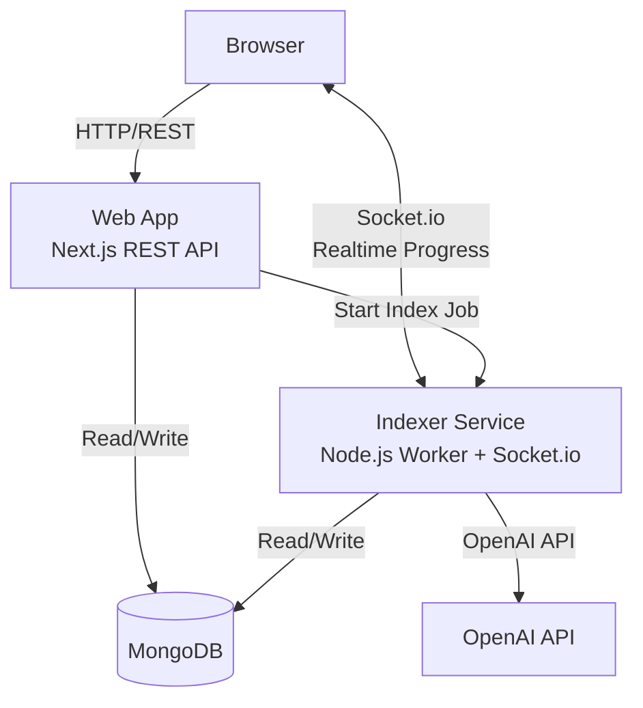

# 00 - Overview

## Purpose

**Trace** helps users trace paths, relationships, and meaning across large, visually rich PDF document sets (schematics, diagrams, manuals, drawings, forms, etc.). It converts documents into **page-level visual units**, uses AI to create **searchable metadata and embeddings**, and provides **workspace-scoped chat** that can retrieve relevant pages iteratively.

### Target Use Cases

- **Engineering**: Navigate complex electrical/mechanical schematics across hundreds of pages
- **Technical Documentation**: Find relationships between diagrams, specs, and manuals
- **Architecture**: Trace building systems across architectural drawing sets
- **Compliance**: Locate related sections across regulatory documents and forms
- **Research**: Explore visual datasets (maps, diagrams, historical documents)

## Core Concepts

### Workspace

A **Workspace** is the primary unit of organization and permissioning:

- Contains documents (uploaded files or URLs)
- Contains derived page artifacts (images + AI analysis + embeddings)
- Contains an ontology (discovered entity/relation types)
- Scopes all search and chat operations
- Is shareable (read-only viewers can be added)
- Has a single owner who controls indexing and documents

**Key principle**: All operations (search, chat, page access) are scoped to a workspace. Users cannot cross workspace boundaries.

### Document

A **Document** represents a single PDF file:

- Can be uploaded by owner or registered via URL
- Is processed into individual pages during indexing
- Tracks its own status (`queued`, `processing`, `ready`, `failed`)
- Stores original PDF in MongoDB
- Belongs to exactly one workspace

### Page

A **Page** is the atomic unit of analysis and retrieval:

- One page from a source PDF document
- Has an AI-optimized image (150-200 DPI JPEG, stored as base64 in MongoDB)
- Has AI-generated analysis (summary, topics, entities, relations, anchors)
- Has an embedding vector for semantic search
- Is independently retrievable and citable

**Key principle**: Pages are the unit of retrieval. The AI assistant works with pages, not documents. Search returns pages, not documents.

### Indexing

Indexing is a **one-time process per workspace** that converts documents into searchable pages:

- Owner triggers indexing when documents are added
- **Re-indexing**: Deletes existing pages and recreates them (no versioning in v1)
- Runs in background with realtime progress updates
- Workspace shows status: `idle`, `queued`, `processing`, `ready`, or `failed`

**Why re-index?** Add new documents, fix errors, or use updated AI models.

### Page Analysis

AI-generated metadata for each page, extracted from the page image using multimodal AI (GPT-4o):

- **Summary**: Natural language description of page contents
- **Topics**: List of subject matter tags
- **Entities**: Named things (components, locations, reference numbers, etc.)
- **Anchors**: Regions of interest with bounding boxes (diagram areas, tables, callouts)
- **Relations**: Connections between entities/anchors/pages (references, connections, continuations)

**Domain-agnostic**: The analysis schema doesn't assume a specific domain. The AI discovers entity types and relation types based on document content.

### Ontology

A **workspace ontology** is synthesized after analyzing all pages:

- **Entity Types**: Discovered categories with descriptions and examples
- **Relation Types**: Discovered connection types with descriptions
- **Aliases**: Canonical mappings (e.g., "Xfmr" → "Transformer")

The ontology helps the chat assistant understand domain-specific terminology.

## Glossary

| Term | Definition |
|------|------------|
| **Workspace** | Container for documents, pages, and index; unit of permissioning |
| **Document** | A single PDF file (uploaded or URL) |
| **Page** | One page from a document; atomic unit of retrieval |
| **Indexing** | Process of converting PDFs to analyzed, searchable pages |
| **Page Analysis** | AI-generated metadata (summary, topics, entities, relations, anchors) |
| **Embedding** | Vector representation of page content for semantic search |
| **Ontology** | Workspace-level schema of discovered entity/relation types |
| **Owner** | User role with full control (upload, index, share, delete) |
| **Viewer** | User role with read-only access (view, search, chat) |
| **Anchor** | Region of interest on a page (diagram area, table, callout, etc.) |
| **Entity** | Named thing extracted from page (component, location, ID, etc.) |
| **Relation** | Connection between entities/anchors/pages |
| **Web App** | Next.js application handling UI and REST API |
| **Indexer** | Separate Node.js service performing PDF processing and AI analysis |
| **Socket.io** | WebSocket library for realtime progress notifications (hosted by Indexer) |

## System Architecture (High-Level)

### Component Responsibilities

- **Browser**: User interface, search, chat, realtime progress display
- **Web App**: Auth, workspace/document CRUD, search API, chat API
- **Indexer**: PDF rendering, AI analysis, embeddings, ontology synthesis, Socket.io server
- **MongoDB**: Source of truth for all state (no caching layer in v1)

See [02-architecture.md](02-architecture.md) for detailed component design.

## Key Design Decisions

### 1. Image Storage in MongoDB

Page images are stored as **base64-encoded JPEG strings** directly in MongoDB Page documents.

**Why?**
- Simplicity: Single data store, single backup, single connection
- Atomic consistency: Metadata and image are always in sync
- No external dependencies: Works identically in dev/staging/prod
- Feasible: Typical page image is 50-150 KB; MongoDB limit is 16 MB

**Trade-off**: Not optimal for CDN-scale serving, but Trace is workspace-scoped and authenticated, not a public image host.

See: [01-data-models.md](01-data-models.md) for Page schema.

### 2. MongoDB as Source of Truth

All state lives in MongoDB. Socket.io is **only for notifications**, not state storage.

**Why?**
- Simplifies client logic: On reconnect, client fetches DB truth
- Avoids sync bugs: No question about "which is right?"
- Enables horizontal scaling: Socket.io rooms can use Redis adapter

**Flow**: Indexer updates DB → emits Socket.io event → Browser updates UI (and refetches on reconnect/completion).

See: [05-realtime.md](05-realtime.md) for realtime design.

### 3. Separate Indexer Service

Indexing runs in a **separate Node.js service**, not in the Web app.

**Why?**
- Resource isolation: Indexing is CPU/memory intensive
- Independent scaling: Can scale indexer workers separately from web servers
- Clean separation: Web handles user requests; Indexer handles batch processing
- Crash isolation: Indexer crash doesn't affect web app

See: [04-indexing-pipeline.md](04-indexing-pipeline.md) for indexing flow.

### 4. Direct Socket.io Connection to Indexer

Browser connects directly to Indexer via Socket.io (not through Web as proxy).

**Why?**
- Simpler: One WebSocket connection, no webhook intermediary
- More reliable: Direct connection, no HTTP callbacks that can fail silently
- Lower latency: No extra hop through Web app
- Natural pattern: Worker emits progress events directly to interested clients

**Security**: Indexer validates NextAuth sessions and workspace membership before allowing room joins.

See: [05-realtime.md](05-realtime.md) for implementation.

### 5. No Index Versioning (v1)

Re-indexing **overwrites** the existing index (deletes pages, recreates them).

**Why?**
- Simplicity: Fewer collections, no version tracking
- Easier to reason about: One index per workspace, always current
- Storage savings: No historical data accumulation
- Can add versioning later if users request comparison/rollback features

**Trade-off**: Can't compare old vs new analyses, can't rollback.

## Navigation

- **Next**: [01-data-models.md](01-data-models.md) - MongoDB schemas
- **Architecture**: [02-architecture.md](02-architecture.md) - System components and flows
- **Implementation**: [11-implementation-plan.md](11-implementation-plan.md) - Build phases
