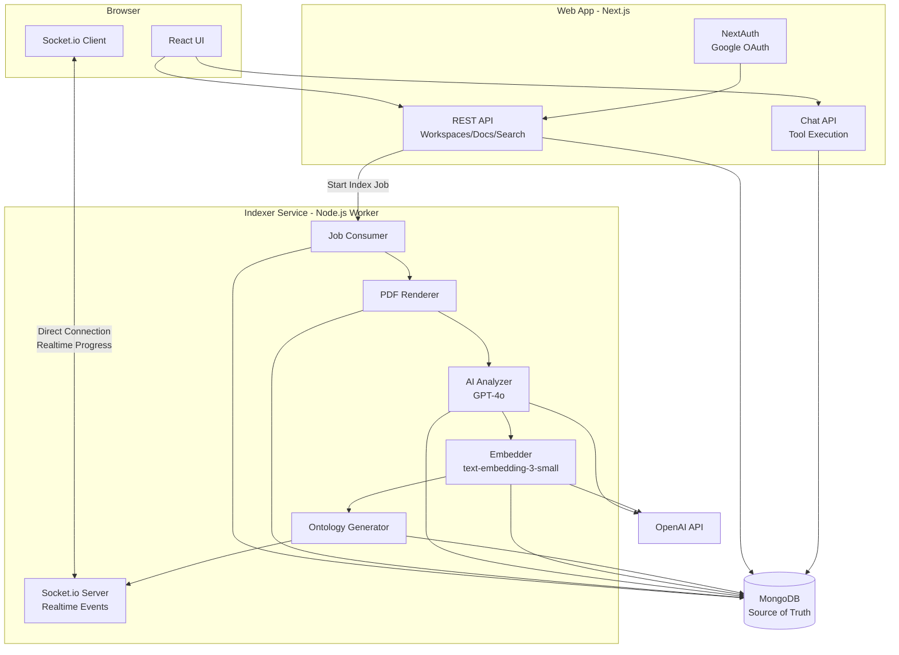
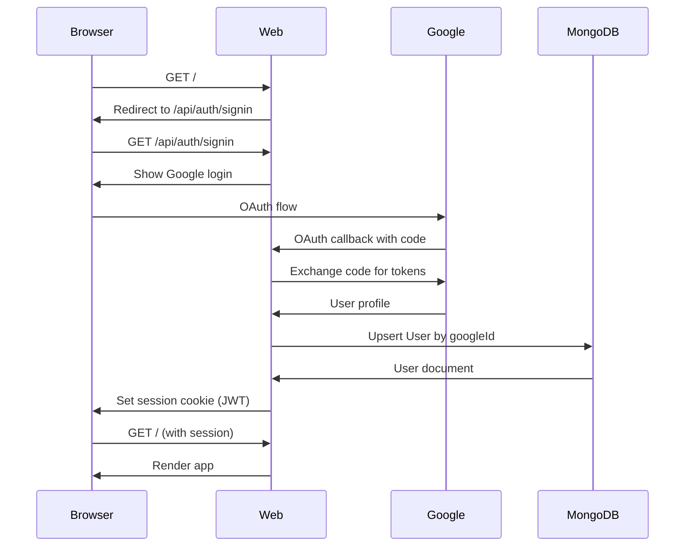
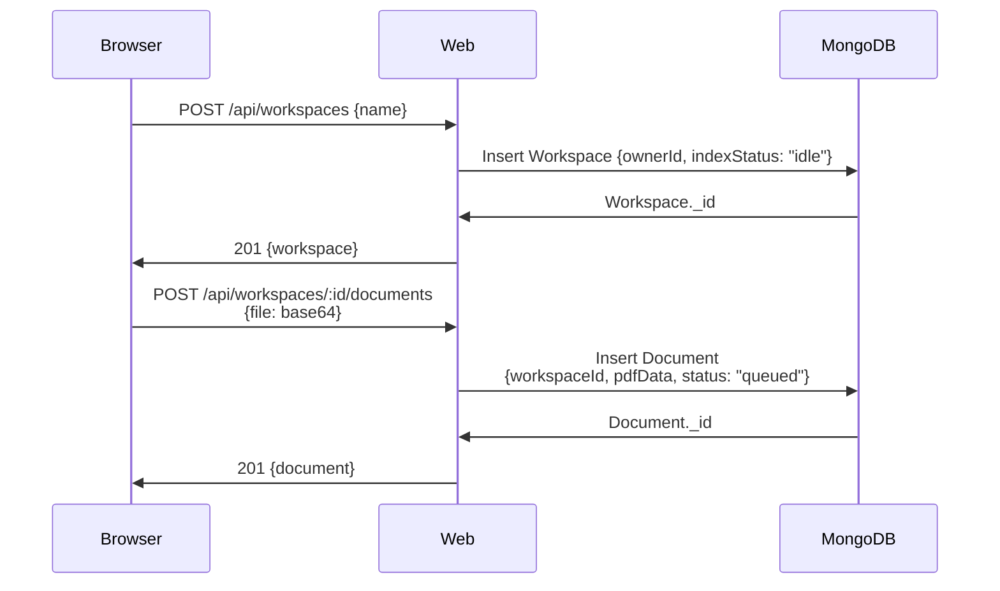
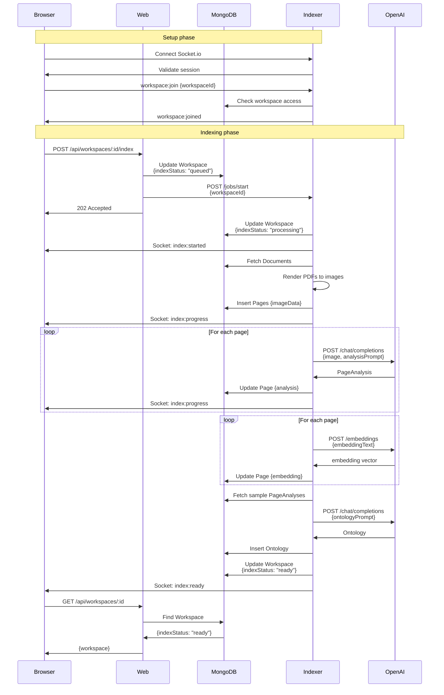
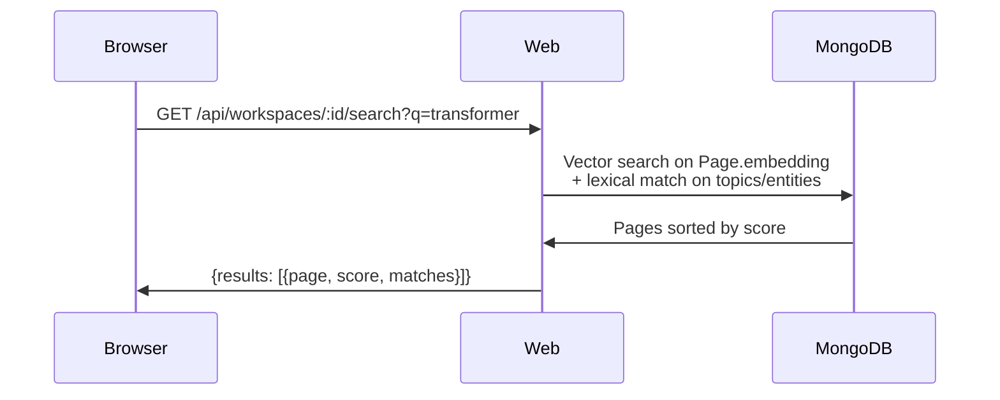
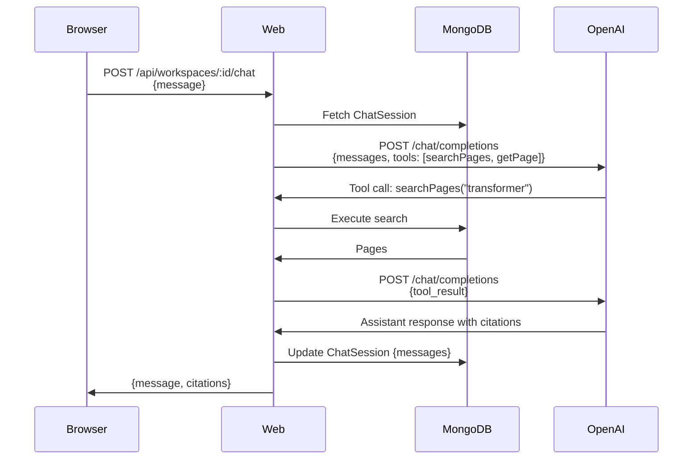

# 02 - Architecture

This document describes the system components, deployment topology, and communication flows.

## System Components



## Component Responsibilities

### Browser (Client)

**Technology**: React (Next.js client-side)

**Responsibilities**:
- Render UI for all user interactions
- Maintain Socket.io connection to **Indexer** for realtime updates
- Fetch workspace/document/page data via REST API (to Web)
- Send chat messages and display responses
- Handle authentication state (NextAuth session)

**State Management**:
- React hooks + context for UI state
- Socket.io events trigger UI updates
- Refetch from API on reconnect/completion (MongoDB is truth)

### Web App (Next.js)

**Technology**: Next.js (API routes only, no custom server needed)

**Responsibilities**:
- Google OAuth authentication (NextAuth)
- Workspace/document CRUD
- Document upload and URL registration
- Search endpoint (hybrid vector + lexical)
- Chat API with tool execution
- Trigger indexing (call Indexer)

**Routes**: See [08-api-contracts.md](08-api-contracts.md)

**Note**: Web app does NOT need custom Node server since Socket.io is hosted by Indexer.

### Indexer Service (Node.js Worker + Socket.io Server)

**Technology**: Node.js standalone service with Socket.io

**Responsibilities**:
- Consume indexing jobs (pull from MongoDB)
- Download/read PDFs from MongoDB
- Render PDF pages to JPEG images (150-200 DPI)
- Call OpenAI GPT-4o to analyze each page image
- Call OpenAI embeddings API to generate vectors
- Synthesize workspace ontology from all analyses
- Update MongoDB with progress and results
- **Host Socket.io server** for realtime browser connections
- Validate browser sessions and workspace access

**Deployment**: Separate from Web app. Can be scaled independently.

See: [04-indexing-pipeline.md](04-indexing-pipeline.md)

#### Socket.io Server

**Hosted by**: Indexer service

**Purpose**: Direct realtime communication with browsers for progress updates

**Authentication**: Validates NextAuth JWT from browser cookie

**Rooms**: One room per workspace (`workspace:{workspaceId}`)

**Events Emitted**:
- `index:started`
- `index:progress`
- `index:ready`
- `index:failed`

See: [05-realtime.md](05-realtime.md)

### MongoDB

**Responsibilities**:
- **Single source of truth** for all application state
- Store users, workspaces, documents, pages, ontologies, chat sessions
- Store PDFs and page images (as base64)
- Provide queries for search (vector similarity + lexical match)

**Collections**: See [01-data-models.md](01-data-models.md)

**Vector Search**: MongoDB Atlas Vector Search (for `Page.embedding`)

### OpenAI API

**Used by**:
- Indexer: GPT-4o for page analysis
- Indexer: text-embedding-3-small for embeddings
- Indexer: GPT-4o for ontology synthesis
- Web: GPT-4o for chat (with tools)

**Rate Limiting**: Indexer throttles concurrent requests (see [10-deployment.md](10-deployment.md))

## Communication Flows

### 1. User Authentication



### 2. Create Workspace & Upload Document



### 3. Trigger Indexing with Realtime Progress



### 4. Search Pages



### 5. Chat with Tool Calls



## Deployment Topology

### Development

```
├── MongoDB (local or Atlas free tier)
├── Web App (localhost:3000)
└── Indexer Service (localhost:4000)
    └── Socket.io server attached
    └── Polls MongoDB for jobs
```

### Production (Single Server)

```
┌─────────────────────────────────────┐
│ VPS / Cloud VM                      │
│                                     │
│  ├── MongoDB (managed Atlas)        │
│  ├── Web App (Next.js)              │
│  │   └── Port 3000                  │
│  └── Indexer Service                │
│      ├── Port 4000 (Socket.io)      │
│      └── Worker process             │
└─────────────────────────────────────┘
```

**Note**: Browser connects to both Web (REST) and Indexer (Socket.io).

### Production (Scaled)

```
┌──────────────────────────────────────────┐
│ Load Balancer                            │
└──────────┬─────────────┬─────────────────┘
           │             │
      ┌────▼────┐   ┌────▼────┐
      │ Web 1   │   │ Web 2   │
      └────┬────┘   └────┬────┘
           │             │
      ┌────▼─────────────▼────┐
      │ MongoDB Atlas          │
      └────┬─────────────┬─────┘
           │             │
      ┌────▼────┐   ┌────▼────────┐
      │Indexer 1│   │ Redis       │
      │+Socket  │   │ (Socket.io  │
      └─────────┘   │  Adapter)   │
      ┌─────────┐   └─────────────┘
      │Indexer 2│
      │+Socket  │
      └─────────┘
```

**Scaling notes**:
- Web: Horizontal scaling (stateless REST API)
- Indexer: Horizontal scaling requires Redis adapter for Socket.io rooms
- MongoDB: Use Atlas for managed hosting and vector search

See: [10-deployment.md](10-deployment.md)

## Data Flow Summary

### Write Paths

1. **User creates workspace** → MongoDB (Workspace)
2. **User uploads document** → MongoDB (Document with pdfData)
3. **User triggers indexing** → MongoDB (status update), Web → Indexer
4. **Indexer processes pages** → MongoDB (Page with imageData, analysis, embedding)
5. **User sends chat message** → MongoDB (ChatSession), OpenAI → response

### Read Paths

1. **User views workspace** → MongoDB (Workspace)
2. **User views documents** → MongoDB (Documents)
3. **User views page** → MongoDB (Page.imageData as data URL)
4. **User searches** → MongoDB (vector + lexical query on Pages)
5. **User chats** → MongoDB (ChatSession, Pages via search), OpenAI (completion)

### Realtime Paths

1. **Indexer updates progress** → MongoDB → Socket.io emit to Browser
2. **Browser reconnects** → Fetch status from MongoDB (source of truth)

## Security Boundaries

| Boundary | Enforcement |
|----------|-------------|
| Browser → Web | HTTPS, NextAuth session cookie |
| Browser → Indexer (Socket.io) | WSS, NextAuth session validation |
| Web → MongoDB | Connection string auth, network isolation |
| Web → Indexer (REST) | Service token (`INDEXER_SERVICE_TOKEN`) |
| Indexer → MongoDB | Connection string auth |
| Web/Indexer → OpenAI | API key |

**Critical**: Indexer Socket.io server validates browser sessions and workspace membership.

## Technology Stack Summary

| Layer | Technology |
|-------|------------|
| Frontend | React, Next.js, Socket.io Client |
| Backend (Web) | Next.js API routes |
| Backend (Indexer) | Node.js, pdf-lib/pdfjs-dist, canvas, Socket.io Server |
| Database | MongoDB (Atlas recommended) |
| Auth | NextAuth (Google OAuth) |
| AI | OpenAI (GPT-4o, text-embedding-3-small) |
| Realtime | Socket.io (hosted by Indexer) |
| Job Queue (future) | BullMQ + Redis |

## Navigation

- **Previous**: [01-data-models.md](01-data-models.md)
- **Next**: [03-auth-permissions.md](03-auth-permissions.md)
- **Related**: [05-realtime.md](05-realtime.md), [10-deployment.md](10-deployment.md)
