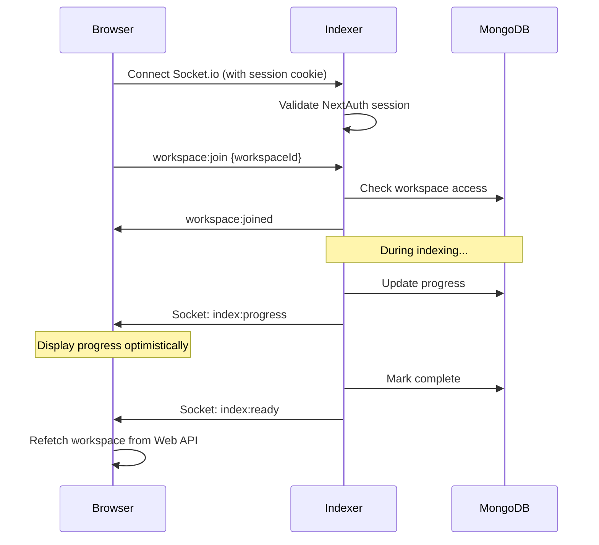

# 05 - Realtime Updates

This document describes the realtime notification system using Socket.io with direct browser-to-Indexer connection.

## Architecture Principle

**MongoDB is the source of truth.** Socket.io provides **notifications only** to avoid manual refresh.

**Direct connection**: Browser connects directly to Indexer's Socket.io server (not proxied through Web).



## Socket.io Server (Hosted by Indexer)

### Custom Node Server in Indexer

The Indexer service hosts Socket.io alongside its worker process.

```typescript
// indexer/src/server.ts
import { createServer } from "http"
import { Server } from "socket.io"
import { getToken } from "next-auth/jwt"
import { getWorkspaceRole } from "./lib/permissions"

const httpServer = createServer()

// Attach Socket.io
const io = new Server(httpServer, {
  cors: {
    origin: process.env.WEB_APP_URL,  // Allow Web app origin
    credentials: true                  // Allow cookies
  }
})

// Authentication middleware
io.use(async (socket, next) => {
  try {
    // Validate NextAuth JWT from cookie
    const token = await getToken({
      req: socket.request,
      secret: process.env.NEXTAUTH_SECRET!
    })
    
    if (!token?.sub) {
      return next(new Error("Authentication required"))
    }
    
    // Attach userId to socket
    socket.data.userId = token.sub
    next()
  } catch (err) {
    next(new Error("Authentication failed"))
  }
})

// Connection handler
io.on("connection", (socket) => {
  console.log("Client connected:", socket.data.userId)
  
  socket.on("workspace:join", async (data) => {
    await handleWorkspaceJoin(socket, data)
  })
  
  socket.on("workspace:leave", async (data) => {
    await handleWorkspaceLeave(socket, data)
  })
  
  socket.on("disconnect", () => {
    console.log("Client disconnected:", socket.data.userId)
  })
})

async function handleWorkspaceJoin(socket: any, data: any) {
  const { workspaceId } = data
  const userId = socket.data.userId
  
  // Verify workspace access
  const role = await getWorkspaceRole(workspaceId, userId)
  
  if (!role) {
    socket.emit("error", { message: "Access denied" })
    return
  }
  
  // Join room
  const roomName = `workspace:${workspaceId}`
  socket.join(roomName)
  
  console.log(`User ${userId} joined workspace ${workspaceId} as ${role}`)
  
  socket.emit("workspace:joined", { workspaceId, role })
}

async function handleWorkspaceLeave(socket: any, data: any) {
  const { workspaceId } = data
  const roomName = `workspace:${workspaceId}`
  socket.leave(roomName)
  
  socket.emit("workspace:left", { workspaceId })
}

// Export io for use in worker
export { io }

// Start server
const port = process.env.PORT || 4000
httpServer.listen(port, () => {
  console.log(`> Indexer Socket.io server ready on http://localhost:${port}`)
})
```

### Permission Check Implementation

```typescript
// indexer/src/lib/permissions.ts
import { ObjectId } from "mongodb"
import { getDb } from "./mongodb"

export type WorkspaceRole = "owner" | "viewer" | null

export async function getWorkspaceRole(
  workspaceId: string,
  userId: string
): Promise<WorkspaceRole> {
  const db = await getDb()
  
  const workspace = await db.collection("workspaces").findOne({
    _id: new ObjectId(workspaceId)
  })
  
  if (!workspace) return null
  
  // Check if owner
  if (workspace.ownerId.toString() === userId) {
    return "owner"
  }
  
  // Check if viewer
  const isMember = workspace.members.some(
    (m: any) => m.userId.toString() === userId
  )
  
  return isMember ? "viewer" : null
}
```

### Emitting Events During Indexing

```typescript
// indexer/src/worker.ts
import { io } from "./server"

async function processIndexJob(workspaceId: string) {
  // Start indexing
  io.to(`workspace:${workspaceId}`).emit("index:started", {})
  
  // During rendering phase
  io.to(`workspace:${workspaceId}`).emit("index:progress", {
    phase: "render",
    docsDone: 1,
    docsTotal: 3,
    pagesDone: 10,
    pagesTotal: 50
  })
  
  // During analyze phase
  io.to(`workspace:${workspaceId}`).emit("index:progress", {
    phase: "analyze",
    docsDone: 1,
    docsTotal: 3,
    pagesDone: 15,
    pagesTotal: 50
  })
  
  // When complete
  io.to(`workspace:${workspaceId}`).emit("index:ready", {
    pageCount: 50
  })
}
```

### Horizontal Scaling

If deploying multiple Indexer instances, use Redis adapter for Socket.io:

```typescript
import { createAdapter } from "@socket.io/redis-adapter"
import { createClient } from "redis"

const pubClient = createClient({ url: process.env.REDIS_URL })
const subClient = pubClient.duplicate()

await Promise.all([pubClient.connect(), subClient.connect()])

io.adapter(createAdapter(pubClient, subClient))
```

See: [10-deployment.md](10-deployment.md)

## Socket.io Client (Browser)

### Connection Setup

```typescript
// lib/indexerSocket.ts
import { io, Socket } from "socket.io-client"

let socket: Socket | null = null

export function getIndexerSocket(): Socket {
  if (!socket) {
    socket = io(process.env.NEXT_PUBLIC_INDEXER_URL, {
      withCredentials: true,  // Send cookies (NextAuth session)
      autoConnect: false
    })
  }
  return socket
}

export function connectIndexerSocket() {
  const socket = getIndexerSocket()
  if (!socket.connected) {
    socket.connect()
  }
}

export function disconnectIndexerSocket() {
  const socket = getIndexerSocket()
  socket.disconnect()
}
```

### React Hook

```typescript
// hooks/useWorkspaceSocket.ts
import { useEffect, useState } from "react"
import { getIndexerSocket } from "@/lib/indexerSocket"

export function useWorkspaceSocket(workspaceId: string) {
  const [connected, setConnected] = useState(false)
  const socket = getIndexerSocket()
  
  useEffect(() => {
    socket.connect()
    
    socket.on("connect", () => {
      console.log("Socket connected to Indexer")
      setConnected(true)
      
      // Join workspace room
      socket.emit("workspace:join", { workspaceId })
    })
    
    socket.on("disconnect", () => {
      console.log("Socket disconnected")
      setConnected(false)
    })
    
    socket.on("workspace:joined", (data) => {
      console.log("Joined workspace room:", data)
    })
    
    socket.on("error", (data) => {
      console.error("Socket error:", data)
    })
    
    return () => {
      socket.emit("workspace:leave", { workspaceId })
      socket.off("connect")
      socket.off("disconnect")
      socket.off("workspace:joined")
      socket.off("error")
    }
  }, [workspaceId])
  
  return { socket, connected }
}
```

### Usage in Component

```typescript
// pages/workspaces/[id]/index.tsx
import { useWorkspaceSocket } from "@/hooks/useWorkspaceSocket"
import { useWorkspace } from "@/hooks/useWorkspace"
import { useState, useEffect } from "react"

export default function WorkspaceIndexPage() {
  const router = useRouter()
  const { id: workspaceId } = router.query
  
  const { workspace, refetch } = useWorkspace(workspaceId)
  const { socket, connected } = useWorkspaceSocket(workspaceId)
  
  const [progress, setProgress] = useState(workspace?.indexProgress)
  
  useEffect(() => {
    // Listen for progress events
    socket.on("index:started", () => {
      console.log("Indexing started")
    })
    
    socket.on("index:progress", (data) => {
      console.log("Progress:", data)
      setProgress({
        phase: data.phase,
        docsDone: data.docsDone,
        docsTotal: data.docsTotal,
        pagesDone: data.pagesDone,
        pagesTotal: data.pagesTotal,
        updatedAt: new Date()
      })
    })
    
    socket.on("index:ready", () => {
      console.log("Indexing complete!")
      // Refetch workspace from Web API to get confirmed state
      refetch()
    })
    
    socket.on("index:failed", (data) => {
      console.error("Indexing failed:", data)
      refetch()
    })
    
    return () => {
      socket.off("index:started")
      socket.off("index:progress")
      socket.off("index:ready")
      socket.off("index:failed")
    }
  }, [socket])
  
  return (
    <div>
      <h1>{workspace?.name}</h1>
      
      <div>
        Status: {workspace?.indexStatus}
        {connected && <span> (connected)</span>}
      </div>
      
      {progress && (
        <div>
          <div>Phase: {progress.phase}</div>
          <div>
            Documents: {progress.docsDone} / {progress.docsTotal}
          </div>
          <div>
            Pages: {progress.pagesDone} / {progress.pagesTotal}
          </div>
          <progress
            value={progress.pagesDone}
            max={progress.pagesTotal}
          />
        </div>
      )}
    </div>
  )
}
```

## Event Types

### index:started

Sent when indexing begins.

**Payload**:
```typescript
{}  // No data
```

### index:progress

Sent during indexing with progress updates.

**Payload**:
```typescript
{
  phase: "fetch" | "render" | "analyze" | "embed" | "ontology" | "finalize",
  docsDone: number,
  docsTotal: number,
  pagesDone: number,
  pagesTotal: number,
  documentId?: string  // Current document being processed
}
```

**Frequency**: Throttled (every 10 pages or every 5 seconds).

### index:ready

Sent when indexing completes successfully.

**Payload**:
```typescript
{
  pageCount: number
}
```

### index:failed

Sent when indexing fails critically.

**Payload**:
```typescript
{
  error: string,
  phase: string  // Phase where failure occurred
}
```

## Client Reconnect Logic

### On Reconnect

When browser reconnects (after network interruption or page reload):

1. Establish socket connection to Indexer
2. Join workspace room
3. **Refetch workspace state from Web API** (MongoDB is source of truth)
4. Display current progress
5. Resume listening for events

```typescript
socket.on("connect", () => {
  console.log("Reconnected")
  
  // Rejoin room
  socket.emit("workspace:join", { workspaceId })
  
  // Refetch truth from Web API
  refetchWorkspace()
})
```

### On index:ready or index:failed

Always refetch workspace state to confirm:

```typescript
socket.on("index:ready", async () => {
  // Refetch workspace from Web API to get confirmed state
  await refetchWorkspace()
  
  // Show success message
  toast.success("Indexing complete!")
})
```

### Debounced Refetch (Optional)

For very frequent progress events, debounce API refetches:

```typescript
import { debounce } from "lodash"

const debouncedRefetch = debounce(refetchWorkspace, 5000)

socket.on("index:progress", (data) => {
  // Update UI optimistically
  setProgress(data)
  
  // Refetch truth (debounced)
  debouncedRefetch()
})
```

## Security

### Socket.io Authentication

Socket connections authenticate via NextAuth JWT:

```typescript
// Indexer validates token from cookie
const token = await getToken({ req: socket.request, secret: process.env.NEXTAUTH_SECRET })
if (!token?.sub) {
  return next(new Error("Authentication required"))
}
```

**Critical**: Indexer must have access to `NEXTAUTH_SECRET` to validate JWTs.

### Workspace Room Authorization

Users can only join rooms for workspaces they have access to:

```typescript
// Indexer checks workspace membership before allowing join
const role = await getWorkspaceRole(workspaceId, userId)
if (!role) {
  socket.emit("error", { message: "Access denied" })
  return
}
socket.join(`workspace:${workspaceId}`)
```

### CORS Configuration

Indexer must allow Web app origin:

```typescript
cors: {
  origin: process.env.WEB_APP_URL,  // e.g., "http://localhost:3000"
  credentials: true                  // Required for cookies
}
```

**Production**: Use HTTPS and exact origin (not wildcard).

## Error Handling

### Socket Connection Errors

```typescript
socket.on("connect_error", (err) => {
  console.error("Connection error:", err.message)
  
  if (err.message === "Authentication required") {
    // Redirect to login
    router.push("/auth/signin")
  }
})
```

### Room Join Errors

```typescript
socket.on("error", (data) => {
  if (data.message === "Access denied") {
    // Show error, redirect to workspace list
    toast.error("You don't have access to this workspace")
    router.push("/workspaces")
  }
})
```

## Testing

### Manual Testing

**Terminal 1** (Indexer):
```bash
cd indexer
npm start
# Socket.io server starts on port 4000
```

**Terminal 2** (Browser DevTools):
```javascript
// Connect to Indexer Socket.io
const socket = io("http://localhost:4000", { withCredentials: true })

socket.on("connect", () => console.log("Connected"))
socket.emit("workspace:join", { workspaceId: "..." })
socket.on("index:progress", console.log)
```

### Automated Testing (Future)

- Unit tests for permission checks
- Integration tests with mock Socket.io server
- E2E tests with Playwright (verify UI updates)

## Navigation

- **Previous**: [04-indexing-pipeline.md](04-indexing-pipeline.md)
- **Next**: [06-search-retrieval.md](06-search-retrieval.md)
- **Related**: [02-architecture.md](02-architecture.md), [03-auth-permissions.md](03-auth-permissions.md)
