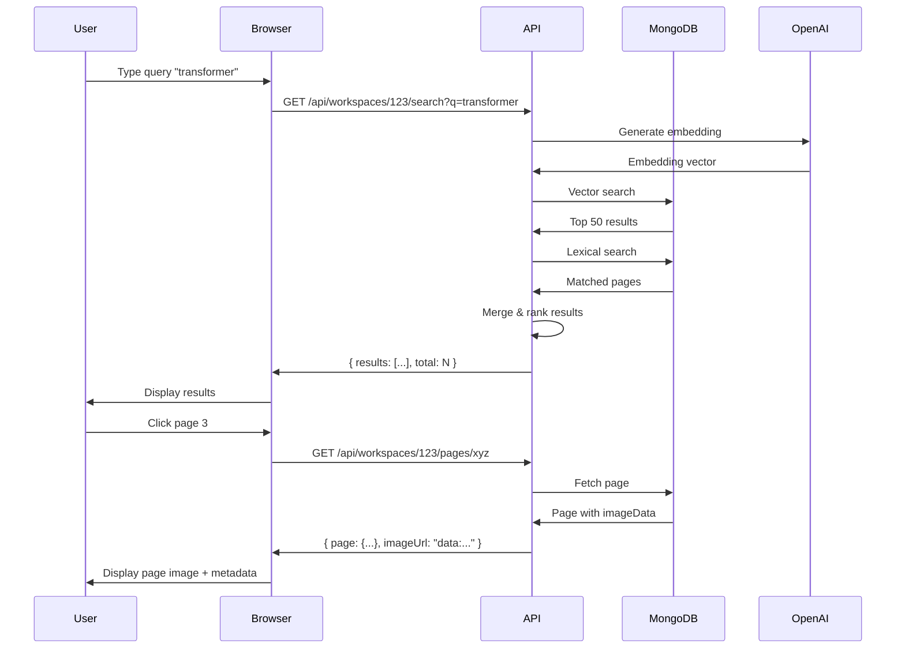

# 06 - Search & Retrieval

This document describes the hybrid search system and page retrieval mechanisms.

## Overview

Search operates at the **page level** within a **workspace scope**.

**Hybrid approach**: Combine semantic (vector) and lexical (keyword) search for best results.

## Search Endpoint

```typescript
GET /api/workspaces/:id/search?q=<query>&limit=<N>
```

### Request Parameters

| Parameter | Type | Required | Default | Description |
|-----------|------|----------|---------|-------------|
| `q` | string | Yes | - | Search query |
| `limit` | number | No | 20 | Max results to return |
| `offset` | number | No | 0 | Pagination offset |

### Response

```typescript
{
  results: [
    {
      page: Page,          // Full page document
      score: number,       // Combined relevance score (0.0-1.0)
      matches: {           // What matched
        vector: number,    // Vector similarity score
        topics: string[],  // Matched topics
        entities: string[] // Matched entities
      }
    }
  ],
  total: number,          // Total matching pages (for pagination)
  query: string
}
```

## Hybrid Search Algorithm

### Step 1: Vector Search

Use MongoDB Atlas Vector Search to find semantically similar pages.

**Query embedding**:
```typescript
const queryEmbedding = await openai.embeddings.create({
  model: "text-embedding-3-small",
  input: query
})
```

**Vector search**:
```typescript
const vectorResults = await db.collection("pages").aggregate([
  {
    $vectorSearch: {
      index: "page_embeddings",
      path: "embedding",
      queryVector: queryEmbedding.data[0].embedding,
      numCandidates: 100,
      limit: 50
    }
  },
  {
    $match: {
      workspaceId: new ObjectId(workspaceId)
    }
  },
  {
    $addFields: {
      vectorScore: { $meta: "vectorSearchScore" }
    }
  }
]).toArray()
```

### Step 2: Lexical Search

Search for keyword matches in `topics` and `entities.value`.

```typescript
const lexicalResults = await db.collection("pages").find({
  workspaceId: new ObjectId(workspaceId),
  $or: [
    { "analysis.topics": { $regex: query, $options: "i" } },
    { "analysis.entities.value": { $regex: query, $options: "i" } },
    { "analysis.summary": { $regex: query, $options: "i" } }
  ]
}).toArray()
```

**Note**: For better performance with large datasets, use MongoDB text indexes:

```typescript
// Create text index
db.collection("pages").createIndex({
  "analysis.summary": "text",
  "analysis.topics": "text",
  "analysis.entities.value": "text"
})

// Query with text search
const lexicalResults = await db.collection("pages").find({
  workspaceId: new ObjectId(workspaceId),
  $text: { $search: query }
}).toArray()
```

### Step 3: Merge and Rank

Combine results with weighted scoring:

```typescript
function mergeResults(vectorResults: any[], lexicalResults: any[], query: string) {
  const resultMap = new Map<string, any>()
  
  // Add vector results
  for (const page of vectorResults) {
    resultMap.set(page._id.toString(), {
      page,
      vectorScore: page.vectorScore || 0,
      lexicalScore: 0,
      matches: {
        vector: page.vectorScore || 0,
        topics: [],
        entities: []
      }
    })
  }
  
  // Add/augment with lexical results
  const queryLower = query.toLowerCase()
  for (const page of lexicalResults) {
    const pageId = page._id.toString()
    
    // Find matches
    const matchedTopics = page.analysis.topics?.filter((t: string) =>
      t.toLowerCase().includes(queryLower)
    ) || []
    
    const matchedEntities = page.analysis.entities?.filter((e: any) =>
      e.value.toLowerCase().includes(queryLower)
    ).map((e: any) => e.value) || []
    
    // Calculate lexical score (0.0-1.0)
    const lexicalScore = Math.min(
      (matchedTopics.length * 0.2) + (matchedEntities.length * 0.1),
      1.0
    )
    
    if (resultMap.has(pageId)) {
      // Augment existing result
      const result = resultMap.get(pageId)!
      result.lexicalScore = lexicalScore
      result.matches.topics = matchedTopics
      result.matches.entities = matchedEntities
    } else {
      // Add new result
      resultMap.set(pageId, {
        page,
        vectorScore: 0,
        lexicalScore,
        matches: {
          vector: 0,
          topics: matchedTopics,
          entities: matchedEntities
        }
      })
    }
  }
  
  // Calculate combined score and sort
  const results = Array.from(resultMap.values()).map(result => {
    // Weighted combination: 70% vector, 30% lexical
    const combinedScore = (result.vectorScore * 0.7) + (result.lexicalScore * 0.3)
    
    return {
      ...result,
      score: combinedScore
    }
  })
  
  results.sort((a, b) => b.score - a.score)
  
  return results
}
```

### Step 4: Pagination

```typescript
function paginateResults(results: any[], offset: number, limit: number) {
  return {
    results: results.slice(offset, offset + limit),
    total: results.length
  }
}
```

## Complete Search Implementation

```typescript
// pages/api/workspaces/[id]/search.ts
import type { NextApiRequest, NextApiResponse } from "next"
import { requireAuth } from "@/lib/auth"
import { requireWorkspaceAccess } from "@/lib/permissions"
import { getDb } from "@/lib/mongodb"
import { ObjectId } from "mongodb"
import OpenAI from "openai"

const openai = new OpenAI({ apiKey: process.env.OPENAI_API_KEY })

export default async function handler(req: NextApiRequest, res: NextApiResponse) {
  if (req.method !== "GET") {
    return res.status(405).json({ error: "Method not allowed" })
  }
  
  const auth = await requireAuth(req, res)
  if (!auth) return
  
  const { id: workspaceId } = req.query
  const { q: query, limit = "20", offset = "0" } = req.query
  
  if (!query || typeof query !== "string") {
    return res.status(400).json({ error: "Query required" })
  }
  
  try {
    // Verify workspace access
    const { workspace } = await requireWorkspaceAccess(
      workspaceId as string,
      auth.userId
    )
    
    if (workspace.indexStatus !== "ready") {
      return res.status(400).json({ error: "Workspace not indexed yet" })
    }
    
    const db = await getDb()
    
    // Generate query embedding
    const embeddingResponse = await openai.embeddings.create({
      model: "text-embedding-3-small",
      input: query
    })
    const queryEmbedding = embeddingResponse.data[0].embedding
    
    // Vector search
    const vectorResults = await db.collection("pages").aggregate([
      {
        $vectorSearch: {
          index: "page_embeddings",
          path: "embedding",
          queryVector: queryEmbedding,
          numCandidates: 100,
          limit: 50
        }
      },
      {
        $match: {
          workspaceId: new ObjectId(workspaceId as string)
        }
      },
      {
        $addFields: {
          vectorScore: { $meta: "vectorSearchScore" }
        }
      }
    ]).toArray()
    
    // Lexical search (using text index)
    const lexicalResults = await db.collection("pages").find({
      workspaceId: new ObjectId(workspaceId as string),
      $text: { $search: query }
    }).toArray()
    
    // Merge and rank
    const mergedResults = mergeResults(vectorResults, lexicalResults, query)
    
    // Paginate
    const limitNum = parseInt(limit as string, 10)
    const offsetNum = parseInt(offset as string, 10)
    const paginated = paginateResults(mergedResults, offsetNum, limitNum)
    
    res.json({
      ...paginated,
      query
    })
    
  } catch (err: any) {
    console.error("Search error:", err)
    res.status(500).json({ error: err.message })
  }
}
```

## MongoDB Vector Search Setup

### Atlas Configuration

1. In MongoDB Atlas console, navigate to: **Search > Create Search Index**
2. Select **Atlas Vector Search**
3. Configuration:

```json
{
  "fields": [
    {
      "type": "vector",
      "path": "embedding",
      "numDimensions": 1536,
      "similarity": "cosine"
    },
    {
      "type": "filter",
      "path": "workspaceId"
    }
  ]
}
```

4. Name the index: `page_embeddings`

### Text Search Index (for lexical search)

```typescript
// Create text index (run once)
await db.collection("pages").createIndex(
  {
    "analysis.summary": "text",
    "analysis.topics": "text",
    "analysis.entities.value": "text"
  },
  {
    name: "page_text_search",
    weights: {
      "analysis.summary": 5,
      "analysis.topics": 3,
      "analysis.entities.value": 2
    }
  }
)
```

## Page Retrieval

### Get Page by ID

```typescript
GET /api/workspaces/:workspaceId/pages/:pageId
```

**Implementation**:

```typescript
// pages/api/workspaces/[workspaceId]/pages/[pageId].ts
export default async function handler(req: NextApiRequest, res: NextApiResponse) {
  const auth = await requireAuth(req, res)
  if (!auth) return
  
  const { workspaceId, pageId } = req.query
  
  try {
    // Verify workspace access
    await requireWorkspaceAccess(workspaceId as string, auth.userId)
    
    const db = await getDb()
    const page = await db.collection("pages").findOne({
      _id: new ObjectId(pageId as string),
      workspaceId: new ObjectId(workspaceId as string)
    })
    
    if (!page) {
      return res.status(404).json({ error: "Page not found" })
    }
    
    // Return page with imageData as data URL
    res.json({
      ...page,
      imageUrl: `data:image/jpeg;base64,${page.imageData}`
    })
    
  } catch (err: any) {
    res.status(500).json({ error: err.message })
  }
}
```

### Get Page by Document + Page Number

```typescript
GET /api/workspaces/:workspaceId/documents/:documentId/pages/:pageNumber
```

**Implementation**:

```typescript
export default async function handler(req: NextApiRequest, res: NextApiResponse) {
  const auth = await requireAuth(req, res)
  if (!auth) return
  
  const { workspaceId, documentId, pageNumber } = req.query
  
  try {
    const { workspace } = await requireWorkspaceAccess(
      workspaceId as string,
      auth.userId
    )
    
    if (workspace.indexStatus !== "ready") {
      return res.status(400).json({ error: "Workspace not indexed" })
    }
    
    const db = await getDb()
    const page = await db.collection("pages").findOne({
      workspaceId: new ObjectId(workspaceId as string),
      documentId: new ObjectId(documentId as string),
      pageNumber: parseInt(pageNumber as string, 10)
    })
    
    if (!page) {
      return res.status(404).json({ error: "Page not found" })
    }
    
    res.json({
      ...page,
      imageUrl: `data:image/jpeg;base64,${page.imageData}`
    })
    
  } catch (err: any) {
    res.status(500).json({ error: err.message })
  }
}
```

## Image Serving

Images are served as **data URLs** (base64-encoded) directly in API responses.

**Pros**:
- No separate image server needed
- Works identically in dev/prod
- Workspace access control automatically enforced

**Cons**:
- Larger JSON payloads
- No browser caching across requests

**Optimization (future)**:
- Add HTTP caching headers (`Cache-Control: private, max-age=3600`)
- Or implement separate image endpoint with signed URLs

### Image Display in Browser

```typescript
// React component
function PageViewer({ page }: { page: Page }) {
  return (
    
  )
}
```

## Advanced Search Features (Future)

### Filters

Add query parameters for filtering:

```typescript
GET /api/workspaces/:id/search?q=...&topics=electrical,mechanical&documentId=...
```

**Implementation**:
```typescript
const filters: any = {
  workspaceId: new ObjectId(workspaceId)
}

if (topics) {
  filters["analysis.topics"] = { $in: topics.split(",") }
}

if (documentId) {
  filters.documentId = new ObjectId(documentId)
}
```

### Facets

Return topic/entity distribution for filtering UI:

```typescript
const facets = await db.collection("pages").aggregate([
  { $match: filters },
  { $unwind: "$analysis.topics" },
  { $group: { _id: "$analysis.topics", count: { $sum: 1 } } },
  { $sort: { count: -1 } },
  { $limit: 20 }
]).toArray()
```

### Relation Search

Find pages by relation type:

```typescript
GET /api/workspaces/:id/search?relationType=connected_to&entity=T-101
```

**Implementation**:
```typescript
const pages = await db.collection("pages").find({
  workspaceId: new ObjectId(workspaceId),
  "analysis.relations": {
    $elemMatch: {
      type: "connected_to",
      $or: [
        { "source.value": "T-101" },
        { "target.value": "T-101" }
      ]
    }
  }
}).toArray()
```

### Bounding Box Search

Find pages with anchors/entities in specific regions:

```typescript
GET /api/workspaces/:id/search?bbox=0.1,0.2,0.5,0.6
```

**Implementation**:
```typescript
const [x, y, w, h] = bbox.split(",").map(Number)

const pages = await db.collection("pages").find({
  workspaceId: new ObjectId(workspaceId),
  $or: [
    {
      "analysis.anchors.bbox": {
        $geoWithin: {
          $box: [[x, y], [x + w, y + h]]
        }
      }
    },
    {
      "analysis.entities.bbox": {
        $geoWithin: {
          $box: [[x, y], [x + w, y + h]]
        }
      }
    }
  ]
}).toArray()
```

**Note**: Requires 2D geospatial index on bbox fields.

## Performance Considerations

### Caching

**v1**: No caching (acceptable for moderate workloads)

**v1.1+**: Add Redis caching for:
- Query embeddings (cache by query string)
- Popular searches (cache results for 5 minutes)

```typescript
const cacheKey = `search:${workspaceId}:${query}:${offset}:${limit}`
const cached = await redis.get(cacheKey)
if (cached) {
  return JSON.parse(cached)
}

// ... perform search ...

await redis.setex(cacheKey, 300, JSON.stringify(results))
```

### Pagination

For large result sets, use cursor-based pagination instead of offset:

```typescript
GET /api/workspaces/:id/search?q=...&after=<pageId>
```

**Implementation**:
```typescript
const cursor = after ? { _id: { $gt: new ObjectId(after) } } : {}

const results = await db.collection("pages")
  .find({ ...filters, ...cursor })
  .sort({ score: -1, _id: 1 })
  .limit(limit)
  .toArray()
```

### Index Optimization

Ensure compound indexes exist:

```typescript
// Workspace queries
db.collection("pages").createIndex({ workspaceId: 1 })

// Document queries
db.collection("pages").createIndex({ workspaceId: 1, documentId: 1, pageNumber: 1 })
```

## Search UI Flow



## Navigation

- **Previous**: [05-realtime.md](05-realtime.md)
- **Next**: [07-chat-system.md](07-chat-system.md)
- **Related**: [01-data-models.md](01-data-models.md) - Page schema
