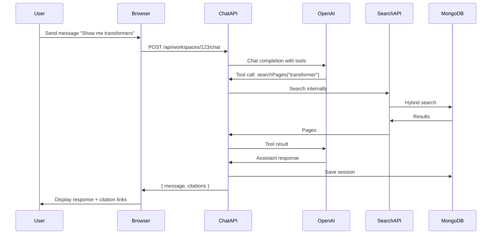

# 07 - Chat System

This document describes the workspace-scoped chat system with AI assistant and tool calling.

## Overview

Chat is **workspace-scoped**: Each conversation uses only that workspace's indexed pages.

The AI assistant has access to **tools** for retrieving pages and search results to ground its responses.

## Chat Session Model

See: [01-data-models.md](01-data-models.md#chatsession) for complete schema.

**Key points**:
- One session per user per workspace (or multiple sessions)
- Messages include role, content, and optional citations
- Tool calls are logged for transparency

## Chat Endpoint

```typescript
POST /api/workspaces/:id/chat
```

### Request

```typescript
{
  sessionId?: string,      // Optional: continue existing session
  message: string,         // User message
  model?: string          // Optional: override default model
}
```

### Response

```typescript
{
  sessionId: string,
  message: {
    role: "assistant",
    content: string,
    citations: [
      {
        documentId: string,
        pageNumber: number,
        pageId: string
      }
    ],
    createdAt: string
  }
}
```

## AI Model Configuration

**Model**: `gpt-4o` (multimodal support for future features)

**System Prompt**:

```typescript
const SYSTEM_PROMPT = `You are a helpful assistant for exploring technical documents.

You have access to a workspace containing analyzed PDF pages. Each page has:
- A visual image
- AI-extracted metadata (summary, topics, entities, anchors, relations)
- An embedding vector for semantic search

Your tools:
- searchPages: Find relevant pages using hybrid search (semantic + keyword)
- getPage: Retrieve a specific page by ID or by document + page number

Guidelines:
1. ALWAYS cite pages you reference using page IDs
2. Use searchPages iteratively to explore the workspace
3. If initial search doesn't find what you need, try different queries
4. Synthesize information across multiple pages when relevant
5. Don't make claims not supported by retrieved pages
6. If you can't find relevant information, say so explicitly
7. Provide page numbers and document references for user convenience

When citing, format as: [Page 3 of Document X]
`
```

## Tools

### searchPages

Search for pages matching a query.

**Definition**:

```typescript
{
  name: "searchPages",
  description: "Search for pages in the workspace using hybrid semantic and keyword search. Returns up to 10 most relevant pages.",
  parameters: {
    type: "object",
    properties: {
      query: {
        type: "string",
        description: "Search query. Can be natural language or keywords."
      },
      limit: {
        type: "number",
        description: "Maximum number of results to return (default: 10, max: 20)",
        default: 10
      }
    },
    required: ["query"]
  }
}
```

**Implementation**:

```typescript
async function toolSearchPages(
  workspaceId: string,
  args: { query: string; limit?: number }
): Promise<any> {
  const limit = Math.min(args.limit || 10, 20)
  
  // Reuse search implementation from 06-search-retrieval.md
  const results = await performHybridSearch(workspaceId, args.query, limit)
  
  // Return simplified format for AI
  return results.map(r => ({
    pageId: r.page._id.toString(),
    documentId: r.page.documentId.toString(),
    pageNumber: r.page.pageNumber,
    summary: r.page.analysis.summary,
    topics: r.page.analysis.topics,
    score: r.score,
    matches: r.matches
  }))
}
```

### getPage

Retrieve a specific page by ID or by document + page number.

**Definition**:

```typescript
{
  name: "getPage",
  description: "Retrieve detailed information about a specific page, including full analysis, entities, relations, and anchors.",
  parameters: {
    type: "object",
    properties: {
      pageId: {
        type: "string",
        description: "Page ID (if known)"
      },
      documentId: {
        type: "string",
        description: "Document ID (if using documentId + pageNumber)"
      },
      pageNumber: {
        type: "number",
        description: "Page number within document (if using documentId + pageNumber)"
      }
    },
    oneOf: [
      { required: ["pageId"] },
      { required: ["documentId", "pageNumber"] }
    ]
  }
}
```

**Implementation**:

```typescript
async function toolGetPage(
  workspaceId: string,
  args: { pageId?: string; documentId?: string; pageNumber?: number }
): Promise<any> {
  const db = await getDb()
  
  let page
  if (args.pageId) {
    page = await db.collection("pages").findOne({
      _id: new ObjectId(args.pageId),
      workspaceId: new ObjectId(workspaceId)
    })
  } else if (args.documentId && args.pageNumber !== undefined) {
    page = await db.collection("pages").findOne({
      workspaceId: new ObjectId(workspaceId),
      documentId: new ObjectId(args.documentId),
      pageNumber: args.pageNumber
    })
  }
  
  if (!page) {
    throw new Error("Page not found")
  }
  
  // Return full analysis (without imageData to save tokens)
  return {
    pageId: page._id.toString(),
    documentId: page.documentId.toString(),
    pageNumber: page.pageNumber,
    analysis: page.analysis
  }
}
```

### Future Tools (v1.1+)

**followRelation**: Traverse relations to find connected pages

```typescript
{
  name: "followRelation",
  description: "Follow a relation from an entity or anchor to find connected pages.",
  parameters: {
    type: "object",
    properties: {
      entityValue: { type: "string" },
      relationType: { type: "string" },
      direction: { enum: ["source", "target", "both"] }
    }
  }
}
```

**getOntology**: Retrieve workspace ontology for understanding domain terminology

```typescript
{
  name: "getOntology",
  description: "Get the workspace ontology showing discovered entity types, relation types, and aliases.",
  parameters: { type: "object", properties: {} }
}
```

## Complete Chat Implementation

```typescript
// pages/api/workspaces/[id]/chat.ts
import type { NextApiRequest, NextApiResponse } from "next"
import { requireAuth } from "@/lib/auth"
import { requireWorkspaceAccess } from "@/lib/permissions"
import { getDb } from "@/lib/mongodb"
import { ObjectId } from "mongodb"
import OpenAI from "openai"

const openai = new OpenAI({ apiKey: process.env.OPENAI_API_KEY })

const SYSTEM_PROMPT = `...` // As defined above

export default async function handler(req: NextApiRequest, res: NextApiResponse) {
  if (req.method !== "POST") {
    return res.status(405).json({ error: "Method not allowed" })
  }
  
  const auth = await requireAuth(req, res)
  if (!auth) return
  
  const { id: workspaceId } = req.query
  const { sessionId, message, model = "gpt-4o" } = req.body
  
  try {
    // Verify workspace access
    const { workspace } = await requireWorkspaceAccess(
      workspaceId as string,
      auth.userId
    )
    
    if (workspace.indexStatus !== "ready") {
      return res.status(400).json({ error: "Workspace not indexed yet" })
    }
    
    const db = await getDb()
    
    // Get or create chat session
    let session
    if (sessionId) {
      session = await db.collection("chatSessions").findOne({
        _id: new ObjectId(sessionId),
        workspaceId: new ObjectId(workspaceId),
        userId: new ObjectId(auth.userId)
      })
      
      if (!session) {
        return res.status(404).json({ error: "Session not found" })
      }
    } else {
      // Create new session
      const result = await db.collection("chatSessions").insertOne({
        workspaceId: new ObjectId(workspaceId),
        userId: new ObjectId(auth.userId),
        messages: [],
        createdAt: new Date(),
        updatedAt: new Date()
      })
      
      session = {
        _id: result.insertedId,
        workspaceId: new ObjectId(workspaceId),
        userId: new ObjectId(auth.userId),
        messages: []
      }
    }
    
    // Add user message
    const userMessage = {
      role: "user" as const,
      content: message,
      createdAt: new Date()
    }
    
    session.messages.push(userMessage)
    
    // Prepare messages for OpenAI
    const messages = [
      { role: "system" as const, content: SYSTEM_PROMPT },
      ...session.messages.map(m => ({
        role: m.role,
        content: m.content
      }))
    ]
    
    // Define tools
    const tools = [
      {
        type: "function" as const,
        function: {
          name: "searchPages",
          description: "Search for pages in the workspace using hybrid semantic and keyword search. Returns up to 10 most relevant pages.",
          parameters: {
            type: "object",
            properties: {
              query: {
                type: "string",
                description: "Search query. Can be natural language or keywords."
              },
              limit: {
                type: "number",
                description: "Maximum number of results to return (default: 10, max: 20)",
                default: 10
              }
            },
            required: ["query"]
          }
        }
      },
      {
        type: "function" as const,
        function: {
          name: "getPage",
          description: "Retrieve detailed information about a specific page.",
          parameters: {
            type: "object",
            properties: {
              pageId: { type: "string", description: "Page ID" },
              documentId: { type: "string", description: "Document ID" },
              pageNumber: { type: "number", description: "Page number" }
            }
          }
        }
      }
    ]
    
    // Execute chat with tools
    const completion = await openai.chat.completions.create({
      model,
      messages,
      tools,
      tool_choice: "auto"
    })
    
    let assistantMessage = completion.choices[0].message
    const citations: any[] = []
    const toolCalls: any[] = []
    
    // Handle tool calls
    while (assistantMessage.tool_calls) {
      messages.push(assistantMessage)
      
      for (const toolCall of assistantMessage.tool_calls) {
        const args = JSON.parse(toolCall.function.arguments)
        let result
        
        try {
          if (toolCall.function.name === "searchPages") {
            result = await toolSearchPages(
              workspaceId as string,
              args
            )
            
            // Collect citations
            for (const page of result) {
              citations.push({
                pageId: page.pageId,
                documentId: page.documentId,
                pageNumber: page.pageNumber
              })
            }
          } else if (toolCall.function.name === "getPage") {
            result = await toolGetPage(
              workspaceId as string,
              args
            )
            
            citations.push({
              pageId: result.pageId,
              documentId: result.documentId,
              pageNumber: result.pageNumber
            })
          }
          
          toolCalls.push({
            tool: toolCall.function.name,
            args,
            result
          })
          
        } catch (err: any) {
          result = { error: err.message }
        }
        
        messages.push({
          role: "tool" as const,
          tool_call_id: toolCall.id,
          content: JSON.stringify(result)
        })
      }
      
      // Get next completion
      const nextCompletion = await openai.chat.completions.create({
        model,
        messages,
        tools,
        tool_choice: "auto"
      })
      
      assistantMessage = nextCompletion.choices[0].message
    }
    
    // De-duplicate citations
    const uniqueCitations = Array.from(
      new Map(citations.map(c => [c.pageId, c])).values()
    )
    
    // Create assistant message
    const assistantMessageDoc = {
      role: "assistant" as const,
      content: assistantMessage.content || "",
      citations: uniqueCitations,
      toolCalls,
      createdAt: new Date()
    }
    
    session.messages.push(assistantMessageDoc)
    
    // Save session
    await db.collection("chatSessions").updateOne(
      { _id: session._id },
      {
        $set: {
          messages: session.messages,
          updatedAt: new Date()
        }
      }
    )
    
    res.json({
      sessionId: session._id.toString(),
      message: {
        role: assistantMessageDoc.role,
        content: assistantMessageDoc.content,
        citations: uniqueCitations,
        createdAt: assistantMessageDoc.createdAt
      }
    })
    
  } catch (err: any) {
    console.error("Chat error:", err)
    res.status(500).json({ error: err.message })
  }
}
```

## Chat UI Flow



## Grounding Rules

To ensure accurate, trustworthy responses:

1. **Always cite sources**: Assistant must reference specific pages
2. **No hallucination**: Don't make claims not supported by retrieved pages
3. **Iterative search**: If first search doesn't find info, try different queries
4. **Explicit uncertainty**: If relevant pages aren't found, say so
5. **Cross-page synthesis**: Combine information from multiple pages when relevant
6. **Entity linking**: Use workspace ontology to understand aliases

**Prompt enforcement** (included in system prompt):

```typescript
const GROUNDING_RULES = `
GROUNDING RULES (CRITICAL):
- ONLY make claims supported by pages you've retrieved
- ALWAYS cite page numbers when referencing information
- If you search and don't find relevant pages, say "I couldn't find information about X in this workspace"
- If initial search is unsuccessful, try alternative queries before giving up
- When uncertain, retrieve more pages rather than guessing
- Format citations as: [Page 5 of Document "filename.pdf"]
`
```

## Session Management

### List Sessions

```typescript
GET /api/workspaces/:id/chat/sessions
```

**Response**:
```typescript
{
  sessions: [
    {
      sessionId: string,
      title: string,          // First user message or generated title
      messageCount: number,
      lastMessageAt: Date,
      createdAt: Date
    }
  ]
}
```

### Get Session

```typescript
GET /api/workspaces/:id/chat/sessions/:sessionId
```

**Response**:
```typescript
{
  session: ChatSession
}
```

### Delete Session

```typescript
DELETE /api/workspaces/:id/chat/sessions/:sessionId
```

## Chat UI Components

### Message List

```typescript
function MessageList({ messages }: { messages: Message[] }) {
  return (
    <div className="messages">
      {messages.map((msg, idx) => (
        <MessageBubble key={idx} message={msg} />
      ))}
    </div>
  )
}

function MessageBubble({ message }: { message: Message }) {
  return (
    <div className={`message ${message.role}`}>
      <div className="content">{message.content}</div>
      
      {message.citations && message.citations.length > 0 && (
        <div className="citations">
          <strong>Sources:</strong>
          {message.citations.map((cite, idx) => (
            <a
              key={idx}
              href={`/workspaces/${workspaceId}/pages/${cite.pageId}`}
              className="citation-link"
            >
              Page {cite.pageNumber}
            </a>
          ))}
        </div>
      )}
    </div>
  )
}
```

### Input Area

```typescript
function ChatInput({ onSend, disabled }: { onSend: (msg: string) => void; disabled: boolean }) {
  const [input, setInput] = useState("")
  
  const handleSubmit = (e: React.FormEvent) => {
    e.preventDefault()
    if (input.trim()) {
      onSend(input)
      setInput("")
    }
  }
  
  return (
    <form onSubmit={handleSubmit} className="chat-input">
      <textarea
        value={input}
        onChange={(e) => setInput(e.target.value)}
        placeholder="Ask about this workspace..."
        disabled={disabled}
        rows={3}
      />
      <button type="submit" disabled={disabled || !input.trim()}>
        Send
      </button>
    </form>
  )
}
```

### Citation Panel

```typescript
function CitationPanel({ citations }: { citations: Citation[] }) {
  return (
    <aside className="citation-panel">
      <h3>Referenced Pages</h3>
      {citations.map((cite) => (
        <PageCard key={cite.pageId} cite={cite} />
      ))}
    </aside>
  )
}

function PageCard({ cite }: { cite: Citation }) {
  const { page } = usePage(cite.pageId)
  
  return (
    <div className="page-card">
      
      <div className="details">
        <strong>Page {cite.pageNumber}</strong>
        <p>{page?.analysis.summary}</p>
      </div>
    </div>
  )
}
```

## Advanced Chat Features (Future)

### Multi-turn Reasoning

Allow assistant to retrieve pages multiple times in a single response:

```typescript
tool_choice: "auto"  // Already implemented
```

### Image Analysis in Chat

Pass page images directly to assistant (requires multimodal):

```typescript
{
  role: "user",
  content: [
    { type: "text", text: "What's in this diagram?" },
    { type: "image_url", image_url: { url: `data:image/jpeg;base64,${pageImageData}` } }
  ]
}
```

### Suggested Queries

Generate follow-up questions based on conversation:

```typescript
const followUpPrompt = `Based on this conversation, suggest 3 follow-up questions the user might ask.`
```

### Export Conversation

```typescript
GET /api/workspaces/:id/chat/sessions/:sessionId/export?format=pdf|markdown
```

## Cost Management

### Token Optimization

1. **Don't send imageData in tool results** (only metadata)
2. **Limit tool result size** (summarize if needed)
3. **Prune old messages** after N turns (keep system prompt + recent context)

```typescript
// Keep only last 10 messages + system prompt
if (messages.length > 11) {
  messages = [messages[0], ...messages.slice(-10)]
}
```

### Rate Limiting

Per-user rate limits:

```typescript
// 20 messages per hour per user
const rateLimitKey = `chat:${userId}:${Date.now() / 3600000}`
const count = await redis.incr(rateLimitKey)
await redis.expire(rateLimitKey, 3600)

if (count > 20) {
  return res.status(429).json({ error: "Rate limit exceeded" })
}
```

## Navigation

- **Previous**: [06-search-retrieval.md](06-search-retrieval.md)
- **Next**: [08-api-contracts.md](08-api-contracts.md)
- **Related**: [01-data-models.md](01-data-models.md) - ChatSession schema
