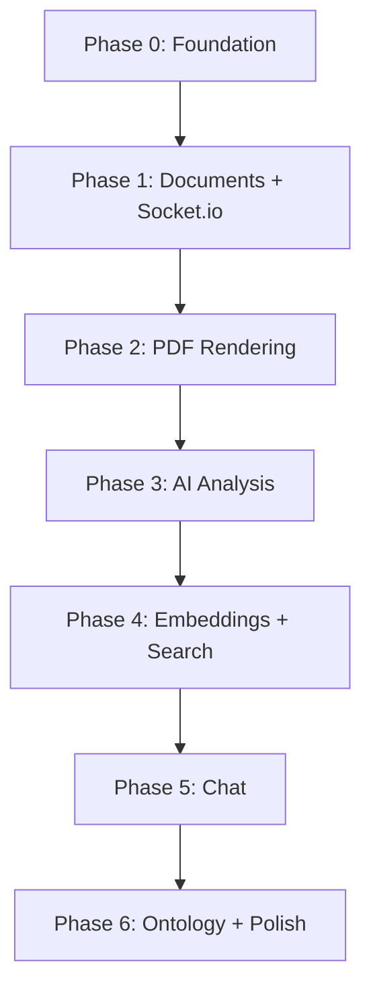

# 11 - Implementation Plan

This document outlines the phased implementation approach for building Trace from scratch.

## Overview

Trace will be built incrementally across **8 phases** (0-6, plus 3.5), with each phase delivering working functionality. This approach allows for:

- Early testing and validation
- Iterative refinement
- Manageable scope per phase
- Working software at each milestone

**Note**: Phase 4 has been revised to focus on **semantic search using rich analysis metadata** instead of vector embeddings. Embeddings can be added later if needed.

## Phase 0: Foundation (Week 1)

**Goal**: Set up project structure, authentication, and database connections.

### Deliverables

1. **Project Setup**
   - Initialize monorepo structure (web + indexer)
   - Configure TypeScript, ESLint, Prettier
   - Set up package.json dependencies
   - Create shared types package at `/packages/shared/`

2. **NextAuth Google OAuth**
   - Install NextAuth
   - Configure Google OAuth provider
   - Create sign-in page
   - Test auth flow

3. **MongoDB Connection**
   - Set up MongoDB Atlas (or local)
   - Create connection utility
   - Test connection in both web and indexer

4. **Basic Workspace CRUD**
   - Create Workspace model
   - Implement API routes:
     - `POST /api/workspaces` (create)
     - `GET /api/workspaces` (list)
     - `GET /api/workspaces/:id` (get)
   - Simple UI for workspace list and creation

### Acceptance Criteria

- ✅ User can sign in with Google
- ✅ User can create a workspace
- ✅ User can view workspace list
- ✅ MongoDB connection works in both services

### Estimated Time

5-7 days

---

## Phase 1: Document Upload & Socket.io (Week 2)

**Goal**: Enable document upload and set up realtime infrastructure.

### Deliverables

1. **Document Upload**
   - Implement API route: `POST /api/workspaces/:id/documents`
   - Handle PDF file upload (convert to base64)
   - Store in MongoDB
   - UI for document list and upload

2. **Document by URL**
   - Implement API route: `POST /api/workspaces/:id/documents/url`
   - Fetch PDF from URL
   - Store in MongoDB

3. **Socket.io Server (Indexer)**
   - Create custom Node server in Indexer
   - Attach Socket.io to Indexer HTTP server
   - Implement authentication middleware (validate NextAuth JWT)
   - Implement workspace room join/leave
   - Test connection from browser to Indexer

4. **Indexer Service Skeleton**
   - Create basic Node.js service structure
   - Implement health check endpoint
   - Implement `POST /jobs/start` endpoint (stub)
   - Test Web → Indexer communication

5. **Browser Socket Connection**
   - Create Socket.io client connection to Indexer
   - Implement workspace room joining
   - Test realtime event receiving

### Acceptance Criteria

- ✅ User can upload PDF documents
- ✅ User can add documents from URLs
- ✅ Documents stored in MongoDB
- ✅ Socket.io connection established from browser to Indexer
- ✅ Browser can join workspace rooms

### Estimated Time

5-7 days

---

## Phase 2: PDF Rendering & Page Viewer (Week 3)

**Goal**: Render PDFs to page images and display them.

### Deliverables

1. **PDF Page Rendering (Indexer)**
   - Install pdf.js or pdf-lib
   - Implement render function (PDF → JPEG base64)
   - Test render quality (150 DPI, quality 85)

2. **Indexing Phase: Fetch + Render**
   - Implement job consumer (poll for queued workspaces)
   - Implement fetch phase (validate PDFs, count pages)
   - Implement render phase (create Page documents with images)
   - Delete existing pages before starting (re-index pattern)
   - Update progress in MongoDB
   - Emit Socket.io progress events to browser

3. **Index Trigger (Web)**
   - Implement `POST /api/workspaces/:id/index`
   - Delete existing pages and ontology
   - Update workspace status to "queued"
   - Call Indexer `/jobs/start`

4. **Index Status UI**
   - Create Index tab in workspace
   - Show current status and progress
   - Display progress bar (realtime via Socket.io)
   - "Start Indexing" button

5. **Page Viewer**
   - Implement `GET /api/workspaces/:id/pages/:pageId`
   - Create page viewer component
   - Display page image (base64 data URL)

### Acceptance Criteria

- ✅ User can trigger indexing
- ✅ PDFs are rendered to page images
- ✅ Progress updates realtime in UI (via Indexer Socket.io)
- ✅ User can view rendered pages
- ✅ Pages stored in MongoDB with images
- ✅ Re-indexing deletes old pages first

### Estimated Time

5-7 days

---

## Phase 3: AI Analysis (Week 4)

**Goal**: Extract structured metadata from page images using AI.

### Deliverables

1. **OpenAI Integration (Indexer)**
   - Install OpenAI SDK
   - Implement page analysis function
   - Craft analysis prompt (see [04-indexing-pipeline.md](04-indexing-pipeline.md))
   - Test with sample pages

2. **Indexing Phase: Analyze**
   - Implement analyze phase
   - Call OpenAI for each page
   - Parse JSON response into PageAnalysis
   - Store in MongoDB
   - Handle errors gracefully
   - Emit progress via Socket.io

3. **Page Metadata UI**
   - Display page analysis in page viewer:
     - Summary
     - Topics (as tags)
     - Entities (as list)
     - Anchors (optional: draw bounding boxes)
     - Relations (as list)

4. **Analysis Inspection**
   - UI for browsing page analyses
   - Filter by topic/entity type
   - Debug view for confidence scores

### Acceptance Criteria

- ✅ Pages are analyzed with AI
- ✅ PageAnalysis stored in MongoDB
- ✅ User can view analysis metadata
- ✅ Analysis quality is good (manual spot-check)

### Estimated Time

5-7 days

---

## Phase 4: Semantic Search (Week 5)

**Goal**: Implement text-based semantic search using rich analysis metadata.

**Note**: We're **skipping embeddings initially**. The rich semantic metadata (summary, topics, entities, anchors, relations) should provide excellent search results. We can add vector embeddings later if needed (e.g., embedding the summary text).

### Deliverables

1. **MongoDB Text Search Setup**
   - Create text indexes on analysis fields:
     - `analysis.summary` (weighted high)
     - `analysis.topics` (array of keywords)
     - `analysis.entities.value` (parts, specifications)
     - `analysis.anchors.label` (diagram sections)
     - `analysis.relations.note` (connection descriptions)
   - Configure index weights for relevance
   - Test search queries and tune scoring

2. **Search API**
   - Implement `GET /api/workspaces/:id/search?q=...`
   - Full-text search across indexed fields
   - Return results with:
     - Page data (image, metadata)
     - Match scores
     - Matched fields/snippets
   - Pagination support
   - Filter by document (optional)

3. **Search UI (Explore Tab)**
   - Create Search/Explore tab in workspace
   - Search input with real-time suggestions
   - Results list showing:
     - Page thumbnail (from imageData)
     - Document name + page number
     - Summary snippet with match highlights
     - Matched topics/entities
     - Relevance score
   - Click result → view page details
   - Empty state for no results

4. **Page Viewer (Modal/Panel)**
   - Display full page image
   - Show metadata (summary, topics, entities, relations)
   - Navigate between pages
   - "View in document" link

### Acceptance Criteria

- ✅ Text indexes created and optimized
- ✅ Search returns relevant results (test with various queries)
- ✅ User can search and explore pages
- ✅ Search quality is good for technical diagrams use case
- ✅ Fast performance (< 500ms for typical queries)

### Future Enhancement

If search quality needs improvement, we can add:
- Vector embeddings of page summaries
- Hybrid search (text + vector)
- This requires MongoDB Atlas for vector search

### Estimated Time

3-5 days (simpler without embeddings)

---

## Phase 5: Chat System (Week 6)

**Goal**: Implement workspace-scoped chat with AI assistant.

### Deliverables

1. **Chat Session Model**
   - Create ChatSession schema
   - Implement session CRUD APIs

2. **Chat API with Tools**
   - Implement `POST /api/workspaces/:id/chat`
   - Define tools: `searchPages`, `getPage`
   - Implement tool execution
   - Handle iterative tool calls
   - Store sessions in MongoDB

3. **Chat UI**
   - Create Chat tab
   - Message list (user + assistant)
   - Input area
   - Display citations as links
   - Session list sidebar

4. **Citation Panel**
   - Show referenced pages
   - Click to view page
   - Thumbnail + summary

### Acceptance Criteria

- ✅ User can send chat messages
- ✅ Assistant responds with tool calls
- ✅ Citations are displayed
- ✅ Chat quality is good (test queries)

### Estimated Time

5-7 days

---

## Phase 6: Ontology & Polish (Week 7)

**Goal**: Synthesize workspace ontology and polish UX.

### Deliverables

1. **Ontology Generation (Indexer)**
   - Implement ontology phase
   - Sample page analyses
   - Use AI to synthesize entity/relation types
   - Store in Ontology collection
   - Emit completion via Socket.io

2. **Ontology UI**
   - Display workspace ontology
   - Show entity types with examples
   - Show relation types
   - Aliases list

3. **Workspace Sharing**
   - Implement member management APIs
   - Create Sharing tab UI
   - Add/remove viewers
   - Test access control

4. **Permissions Enforcement**
   - Audit all API routes
   - Verify owner/viewer checks
   - Test Socket.io room access control
   - Test as viewer role

5. **Error Handling & Polish**
   - Add error boundaries
   - Improve loading states
   - Add empty states
   - Better error messages
   - Toast notifications

6. **Documentation**
   - Update README with setup instructions
   - Document environment variables
   - Create user guide (basic)

### Acceptance Criteria

- ✅ Ontology generated and displayed
- ✅ Sharing works correctly
- ✅ Permissions enforced properly (including Socket.io)
- ✅ UX is polished and error-free
- ✅ Documentation is complete

### Estimated Time

5-7 days

---

## Post-v1 Enhancements (Future)

### Phase 7: Advanced Features (Future)

**Potential additions**:

1. **Relation Graph Traversal**
   - "Trace mode" for following relations
   - Graph visualization
   - Multi-hop queries

2. **Advanced Search Filters**
   - Filter by topic, entity type, document
   - Faceted search UI
   - Bounding box search

3. **Chat Improvements**
   - Streaming responses
   - Suggested follow-up questions
   - Multi-turn reasoning improvements
   - Image analysis in chat (send page images)

4. **Collaboration**
   - Shared annotations
   - Comments on pages
   - @mention teammates in chat

5. **Export & Reporting**
   - Export search results to PDF
   - Export chat conversations
   - Generate workspace reports

6. **Performance Optimization**
   - Redis caching for search
   - CDN for page images (S3 + CloudFront)
   - Cursor-based pagination
   - Background job queue (BullMQ)

7. **Analytics**
   - Usage metrics dashboard
   - Search analytics
   - Chat quality metrics
   - Cost tracking

8. **Index Versioning (if requested)**
   - Multiple index versions per workspace
   - Version comparison UI
   - Rollback capability

---

## Development Workflow

### Daily Standup (Solo)

Even solo, maintain discipline:
1. What did I complete yesterday?
2. What am I working on today?
3. Any blockers?

### Testing Strategy

**Per phase**:
- Manual testing of new features
- Basic API tests (Jest)
- Integration tests for critical flows

**Before production**:
- E2E tests (Playwright) for happy paths
- Load testing (k6) for search/chat
- Security audit

### Git Workflow

**Branches**:
- `main` - production-ready code
- `develop` - integration branch
- `feature/phase-N-description` - feature branches

**Commits**:
- Atomic commits with clear messages
- Use conventional commits: `feat:`, `fix:`, `docs:`

**Releases**:
- Tag each phase: `v0.1.0` (Phase 0), `v0.2.0` (Phase 1), etc.
- Semantic versioning: v1.0.0 when Phase 6 complete

### Code Review (Solo)

Before merging feature branches:
1. Self-review diff
2. Test locally
3. Check for console errors
4. Verify no commented-out code
5. Run linter

---

## Dependencies & Prerequisites

### Before Starting

1. **Accounts**:
   - Google Cloud Console (OAuth)
   - MongoDB Atlas
   - OpenAI API

2. **Tools**:
   - Node.js 20+
   - npm or pnpm
   - Git
   - MongoDB Compass (optional, for DB inspection)

3. **Skills**:
   - TypeScript
   - React / Next.js
   - Node.js
   - MongoDB
   - OpenAI API
   - Socket.io

### Phase Dependencies

Each phase builds on the previous. Cannot skip phases without losing functionality.

---

## Risk Mitigation

### Technical Risks

| Risk | Mitigation |
|------|------------|
| OpenAI rate limits | Implement throttling, use token bucket algorithm |
| MongoDB size limits (16 MB) | Verified page images fit comfortably (~100-200 KB) |
| Socket.io scaling | Plan for Redis adapter from start (Indexer) |
| PDF rendering quality | Test multiple DPI settings, tune quality |
| AI analysis accuracy | Iterative prompt refinement, test with diverse docs |

### Schedule Risks

| Risk | Mitigation |
|------|------------|
| Feature creep | Strict phase boundaries, defer non-critical features |
| Underestimation | Add 20% buffer to each phase |
| Blockers | Maintain list of blockers, escalate early |

---

## Success Metrics

### Phase Completion

Each phase is considered complete when:
- ✅ All deliverables are implemented
- ✅ All acceptance criteria are met
- ✅ Manual testing passes
- ✅ No critical bugs
- ✅ Code is merged to `develop`

### v1.0 Launch Criteria

Ready to launch when:
- ✅ All phases 0-6 complete
- ✅ E2E tests pass
- ✅ Security audit passed
- ✅ Documentation complete
- ✅ Deployed to production environment
- ✅ Tested with real documents (>100 pages)
- ✅ Performance acceptable (search < 2s, chat < 5s)

---

## Timeline Summary

| Phase | Duration | Cumulative |
|-------|----------|------------|
| Phase 0 | 1 week | 1 week |
| Phase 1 | 1 week | 2 weeks |
| Phase 2 | 1 week | 3 weeks |
| Phase 3 | 1 week | 4 weeks |
| Phase 4 | 1 week | 5 weeks |
| Phase 5 | 1 week | 6 weeks |
| Phase 6 | 1 week | 7 weeks |
| Buffer | 1 week | 8 weeks |

**Total**: ~8 weeks to v1.0

**Note**: Timeline assumes full-time work (40 hrs/week). Adjust proportionally for part-time.

---

## Next Steps

1. Review all spec documents (00-11)
2. Set up development environment
3. Create Git repository
4. Begin Phase 0 implementation
5. Track progress using todos
6. Update implementation plan as needed

---

## Navigation

- **Previous**: [10-deployment.md](10-deployment.md)
- **Start Here**: [00-overview.md](00-overview.md)
- **Related**: All specification documents (00-11)
